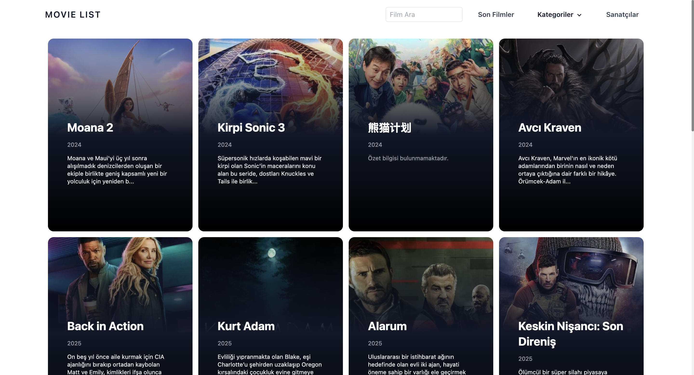
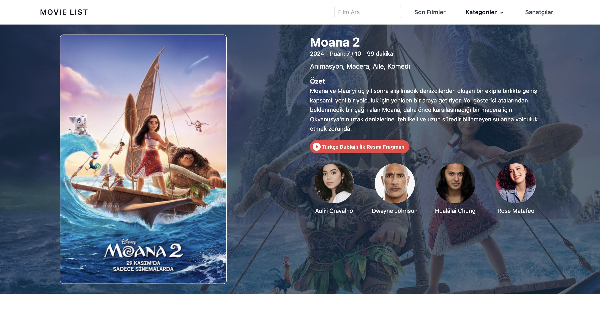

# Photos
Home Page                 |  Movie Detail Page
:-------------------------:|:-------------------------:
  |  

# EN - Movie Information App

This project is a movie information application developed using React and Tailwind CSS. It fetches movie details, trailers, and cast information from The Movie Database (TMDb) API.

## Features

- **Home Page**: Displays a list of popular movies.
- **Movie Detail Page**: Shows detailed information about a selected movie, including its trailer and cast.
- **Search Functionality**: Allows users to search for movies by title.
- **Responsive Design**: The application is fully responsive and works on all devices.

## Setup

To run the project locally, follow these steps:

1. Clone this repository:
    ```bash
    git clone https://github.com/kemalgundogdu/movies.git
    ```

2. Navigate to the project directory:
    ```bash
    cd movies
    ```

3. Install the required dependencies:
    ```bash
    npm install
    ```

4. Set up the environment variables:
    Create a `.env` file and add your TMDb API access token:
    ```plaintext
    REACT_APP_ACCESS_TOKEN=your_access_token
    ```

5. Start the project:
    ```bash
    npm start
    ```

## Technologies Used

- **React**: For building the user interface.
- **Tailwind CSS**: For styling and design.
- **TMDb API**: For fetching movie data.
- **Axios**: For making API requests.
- **React Query**: For managing server state.

## Contributing

If you would like to contribute, please submit a pull request or open an issue.

## License

This project is licensed under the MIT License.

---

# TR - Film Bilgi Uygulaması

Bu proje, React ve Tailwind CSS kullanılarak geliştirilmiş bir film bilgi uygulamasıdır. The Movie Database (TMDb) API'sinden film detaylarını, fragmanlarını ve oyuncu kadrosunu getirir.

## Özellikler

- **Ana Sayfa**: Popüler filmlerin listesini gösterir.
- **Film Detay Sayfası**: Seçilen film hakkında detaylı bilgi, fragman ve oyuncu kadrosunu gösterir.
- **Arama Fonksiyonu**: Kullanıcıların film başlığına göre arama yapmasını sağlar.
- **Duyarlı Tasarım**: Uygulama tamamen duyarlıdır ve tüm cihazlarda çalışır.

## Kurulum

Projeyi yerel ortamınızda çalıştırmak için aşağıdaki adımları izleyin:

1. Bu depoyu klonlayın:
    ```bash
    git clone https://github.com/kemalgundogdu/movies.git
    ```

2. Proje dizinine gidin:
    ```bash
    cd movies
    ```

3. Gerekli bağımlılıkları yükleyin:
    ```bash
    npm install
    ```

4. Çevresel değişkenleri ayarlayın:
    `.env` dosyasını oluşturun ve TMDb API erişim tokeninizi ekleyin:
    ```plaintext
    REACT_APP_ACCESS_TOKEN=your_access_token
    ```

5. Projeyi başlatın:
    ```bash
    npm start
    ```

## Kullanılan Teknolojiler

- **React**: Kullanıcı arayüzünü oluşturmak için.
- **Tailwind CSS**: Stil ve tasarım için.
- **TMDb API**: Film verilerini çekmek için.
- **Axios**: API isteklerini yapmak için.
- **React Query**: Sunucu durumunu yönetmek için.

## Katkıda Bulunma

Katkıda bulunmak isterseniz, lütfen bir pull request gönderin veya bir issue açın.

## Lisans

Bu proje MIT Lisansı ile lisanslanmıştır.
